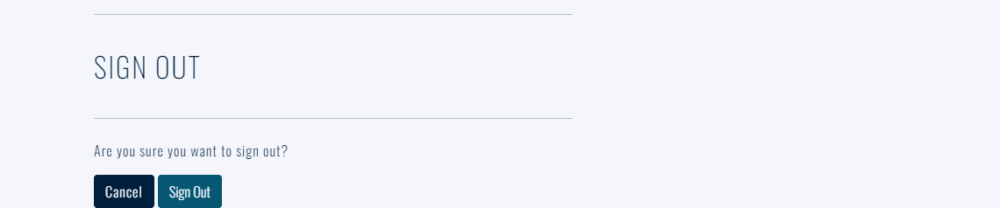
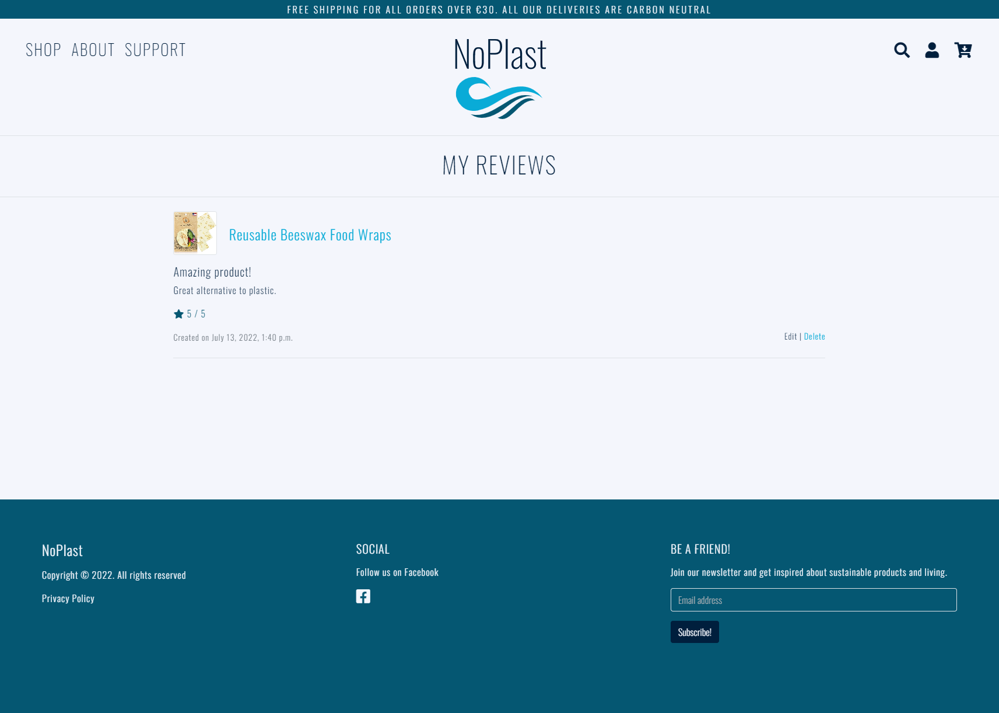

# NoPlast


NoPlast is an ecommerce website offering a variety of plastic-free products. 

The main purpose of the website is to provide site users with eco-friendly alternatives to single-use plastic products that are bad for the environment. 

Another goal the website wants to achieve is to create consciousness about plastic pollution and in this way reduce plastic waste. Site users are also given the option to support charities that are fighting to protect our world's oceans from plastic pollution by making a donation. 

Visit the deployed website [here](https://noplast.onrender.com/).


## Table of Contents

1. [User Experience (UX)](#user-experience-ux)
    1. [Strategy](#strategy)
        1. [Project Goals](#project-goals)
        2. [User Goals](#user-goals)
        3. [Strategy Table](#strategy-table)
    2. [Scope](#scope)
        1. [User Stories](#user-stories)
    3. [Structure](#structure)
        1. [Database Model](#database-model)
    4. [Skeleton](#skeleton)
        1. [Wireframes](#wireframes)
    5. [Surface](#surface)
        1. [Color Scheme](#color-scheme)
        2. [Typography](#typography)
2. [Marketing](#marketing)
   1. [Search Engine Optimisation](#search-engine-optimisation)
   2. [Business Model](#business-model)
3. [Features](#features)
   1. [General](#general)
   2. [Home Page](#home-page)
   3. [Products Page](#products-page)
   4. [Product Details Page](#product-details-page)
   5. [Products Admin](#products-admin)
   5. [Shopping Bag Page](#shopping-bag-page)
   6. [Checkout Page](#checkout-page)
   7. [Checkout Success Page](#checkout-success-page)
   8. [Profile Page](#profile-page)
   9. [Favorites Page](#favorites-page)
   10. [Reviews Page](#reviews-page)
   11. [Reviews Admin](#reviews-admin)
   12. [Organizations Page](#organizations-page)
   13. [Accounts Pages](#accounts-pages)
   14. [404 Error Page](#404-error-page)
4. [Technologies Used](#technologies-used)
    1. [Languages Used](#languages-used)
    2. [Libraries and Frameworks](#languages-and-frameworks)
    3. [Packages / Dependencies Installed](#packages--dependencies-installed)
    4. [Database Management](#database-management)
    5. [Payment Service](#payment-service)
    6. [Cloud Storage](#cloud-storage)
    7. [Tools and Programs](#tools-and-programs)
5. [Testing](#testing)
    1. [Go to TESTING.md](https://github.com/josswe26/noplast/blob/main/TESTING.md#noplast-testing)
6. [Deployment](#deployment)
    1. [How To Use This Project](#how-to-use-this-project)  
    2. [Deployment to Heroku](#deployment-to-heroku)   
    3. [AWS Bucket Creation](#aws-bucket-creation)  
    4. [Connect Django to AWS Bucket](#connect-django-to-aws-bucket)
7. [Finished Product](#finished-product)
8. [Credits](#credits)
9. [Known Bugs](#known-bugs)
10. [Acknowledgements](#acknowledgements)


***


## User Experience (UX)


### Strategy


#### Project Goals

* Responsive design to make the website accessible on different screen sizes.

* Structure is easy to understand and navigates effortlessly for an easy shopping experience.

* The website desing and colors are appealing to the customers.

* Customers are offered the opportunity to register an account.

* Easy shopping process to create a pleaseant experince for the customer.


#### User Goals

**Epic 1 - Shopping Experience**

* As a shopper, I want to easily find the products and their details.

* As a shopper, I want to view products on a specific category.

* As a shopper, I want to be able to sort the products depending on their price, rating or category.

* As a shopper, I want to be able to search for products using specific keywords.

* As a shopper, I want to easily select the quantity of products to be purchased.

* As a shopper, I want to easily view the current purchase amount.

**Epic 2 - Shopping Bag and Checkout**

* As a shopper, I want to view all items currently on my shopping bag and be able to update them.

* As a shopper, I want to easily provide my shipping and payment information during the checkout.

* As a shopper, I want to feel my personal and payment data is being handled securely.

* As a shopper, I want to receive an order confirmation once I have finished my purchase.

* As a shopper, I want to receive an order confirmation email for my records.

**Epic 3 - User Accounts**

* As a frequent shopper, I want to be able to register an account using my email address to be able to keep my records and interact with the website.

* As a frequent shopper, I want to receive a confirmation once my account has been registered to make sure the information entered was correctly.

* As a registered shopper, I want to easily log in and out from my account.

* As a registered shopper, I want to be able to recover access to my account in case I forget my password.

* As a registered shopper, I want to have a personalized profile page where I can keep my contact information updated and see my past orders.

**Epic 4 - Product Reviews**

* As a shopper, I want to be able to read product reviews left by other shoppers.

* As a shopper, I want to be able to sort the reviews by date or rating.

* As a registered shopper, I want to be able to leave product reviews and rate the products.

**Epic 5 - Favorites**

* As a registered shopper, I want to be able to keep a list of my favorite products to purchase again in the future.

* As a registered shopper, I want to be able to easily add and remove favorite products.


**Epic 6 - Product Admin**

* As a site admin, I want to be able to add and update products.

* As a site admin, I want to be able to remove product no longer available.

**Epic 7 - Support Organizations**

* As a site admin, I want to give the users the opportunity to support organizations helping to reduce plastic waste.

**Epic 8 - Newsletter Subscription**

* As a site admin, I want shoppers to be able to provide their contact information to be able to reach out to them with information and offers.


#### Strategy Table

Opportunity / Problem | Importance | Viability / Feasibility
--- | --- | ---
Responsive design | 5 | 5
Create, edit and delete products | 5 | 5
Account registration | 5 | 5
User profile | 5 | 5
Wishlist | 4 | 4
Save shipment information | 5 | 5
Product quick view | 3 | 2
Sort products by different criteria | 5 | 5
Search products by name or description | 5 | 5
Product details view | 5 | 5
Display similar products at the a product details view | 3 | 2
Rate products | 4 | 3
Write product reviews | 4 | 3
Display current purchase total | 5 | 5
View current shopping cart | 5 | 5
Edit quantities inside the shopping bag | 4 | 4
Shopping cart quick view | 3 | 3
Card payment | 5 | 5
Additional payment options | 3 | 2
Donations | 4 | 3
Newsletter subscription | 5 | 5
Bonus system | 3 | 1
**Total** | **95** | **87**


### Scope

According to the strategy table, not all features can be implemented in the first release of the project. For this reason, the project will be divided in multiple phases. The first phase will include the features that have been identified in order to build the minimum viable product.


**First Phase**

* Responsive design

* Create, edit and delete products

* Account registration

* User profile

* Save shipment information

* Sort products by different criteria

* Search products by name or description

* Product details view

* Display current purchase total

* View current shopping cart

* Edit quantities inside the shopping bag

* Card payment

* Newsletter subscription


**Second Phase**

* Wishlist

* Rate products

* Write product reviews

* Donations


**Third Phase**

* Product quick view

* Display similar products at the a product details view

* Shopping cart quick view

* Additional payment options

* Bonus system


#### User Stories

GitHub projects was used as my project management tool to track user stories. Using a Kanban board helped to focus on specific tasks and track the project progress.

**Start**


**Sprint 1**


**Sprint 2**


**Sprint 3**


**Sprint 4**


**Sprint 5**


**Sprint 6**


### Structure

The website has been organized in a Hierarchical Tree Structure to ensure the site user navigates through the site effortlessly and intuitively. Here you can you can find the website map design.


* Header, footer and navigation bar are consistent through all pages.

* Links and forms provide clear feedback to the site user.

* New additional content features are provided for the shopper once they register an account.

* A 404-error page is available.


#### Database Model

The database model has been designed using [drawsql](https://drawsql.app/). The type of database being used for the is relational database being managed using SQLite3 during development and deployed using [PostgreSQL](https://www.postgresql.org/).


### Skeleton


#### Wireframes

[Balsamiq](https://balsamiq.com/) has been used to showcase the appearance of the site and display the placement of the different elements whitin the pages.

Page | Desktop Version | Mobile Version
--- | --- | ---
Home |  | 
Products |  | 
Product Details |  | 
Shopping Bag (Quick View) |  | 
Shopping Bag |  | 
Checkout |  | 
Profile |  | 

### Surface


#### Color Scheme


The colors used in the website are a series of blue tones to represent the stunning ocean colors and this way captivate our shoppers.

We use Oxford Blue (#001F3D) for the main text, main buttons, navbar links and other links, as well as in some dark backgrounds to create color contrast across the website.

For secondary buttons, footer background, as well as for links transitions we use a Blue Sapphire (#055772). As well as to highlight some of the text and titles.

Cerulean Crayola (#09ABD7) is sparingly used, mainly in transitions and to highlight some critical links.

We used Ghost White (#F4F6FC) for the main background and in text located within the dark backgrounds.


#### Typography

The font used across the whole site is Oswald. It was used in two different weights.

After some research on popular ecommerce business fonts. We decided to go with Oswald mainly for its simplicity, which makes it easy to read but at the same time being attention-grabbing.


[Back to top ⇧](#noplast)


## Marketing


### Search Engine Optimisation

Search Engine Optimisation

To improve the search index rating on Google, research was carried out using a number of tools, such as [Wordtracker](https://www.wordtracker.com/) to search for relevant keywords to use in meta tags in the project head element.

Search terms such as plastic free products and eco friendly were used to return popular keywords. A number of short and long tail keywords were then selected and inputted into the head element of base.html.

The selected keywords are:

* eco friendly products
* sustainability products
* environmentally friendly
* non plastic materials
* reusable products
* non plastic products
* plastic-free products

These keywords remain a work in progress however. As is normal practise, in production these keywords would be monitored via, for example, Google Analytics, to determine which terms are driving traffic to the site. 

These terms could then be added to, or removed as deemed necessary, and with continual improvement and refinement of these over time should utlimately assist in the site ranking higher on Google.


### Business Model


#### Company description

NoPlast is a B2C company that offer our customers plastic- free alternatives to plastic products in order to help us in our mission, to reduce the plastic consumption. Additionally, we provide information to create consciousness about plastic pollution and help our customers to take active choices in order to reduce their plastic waste.


#### Customers

Our thought costumers are millennials and younger, singles and families who have an environmental interest and a will to reduce their plastic consumption.

#### Competitors

We see that we have three types of competitors. 
There are companies that have the same interest and vision as NoPlast. But they are mainly focusing on a smaller range of products, such as baby products, hygiene and makeup, or kitchen products, while we have a wider range of products (Lilla Lammet, Less Plastic, Ecco-Verde, etc.).
The other type of competitors that are bigger and have all kinds of products, but they supply both environmental and plastic products and it is therefore not as easy to get a good overview and get inspired of new plastic free products, and environmental tips at the same place. (Åhlens, IKEA etc.).
There are some companies that offer the same kind of range as we do (Be Plast Free and Rekoshoppen). But they are not on the informative aspect to solve the plastic waste problem.

#### SWOT analysis

**Strengths**

* Many environmentally friendly products gathered in the same home page.
* Information for the customer that gives them a deeper insight regarding plastic pollution and how to make better choices. 
* True interest for our mission within the company.

**Weaknesses**

* New brand
* Small marketing budget

**Opportunities**

* Not many companies that have gathered a wide range of products on the same page in Sweden.
* Cooperation with bigger brands and organizations.

**Threats**

* Shipping problem with products produced in other countries due to covid and other unpredictable factors.
* Shipping costs that is variable
* Bigger companies that can change their product supply.
* Smaller environmental friendly companies that can wider their supply from one type of products.
* Other similar companies can get more PR and bigger market share. 

**Marketing Strategy**

Due to our small marketing budget, we have decided to start a Facebook Business page and interact with our customers and bigger organizations within the environmentally friendly branch through that marketing channel. For our buying customers we have made it easy to sign up for our newsletter, in order to make them even more loyal and facilitate for them to share tips and products with their friends and family. Now, in this stage of starting a new company we rely a lot on “word of mouth” and that cooperation’s with organizations and influencers to bring value to the company by attracting more visitors for our homepage and more buying customers.

**Facebook Business page**

See the live Facebook Business page [here](https://www.facebook.com/NoPlast-107480112033116).


## Features


### General

* The website has been designed from a mobile first perspective.

* Responsive design across all device sizes.


#### Header


* The header contains the main logo, navigation links and search product functionality.

* The main logo works as a link to the home page.

* The navigation links allow the shopper access to all sections to facilitate navigation across the website. It also has a hover effect that changes color to provide feedback to the shopper for a better user experience.

* The shopping bag icon changes, reflecting the current status. The current shopping amount is displayed for the shopper.


#### Search Bar


* The search bar allows the user to search the website for products using specific keywords.

* The search can is hidden at first for better visuals and can be toggled using the search icon link in case the shopper needs.


#### Footer


* The footer contains business information as well as links to our Facebook page and privacy policy.

* A newsletter registration form has been located at the footer allowing the shopper to subscribe across the whole website.


### Home Page


#### Categories Section


* Display to the shopper the product categories available, providing a link to each category.


#### About Section


* Provide relevant information to the shopper looking to learn more about our business.


#### Guide Section


* Provides useful information to the shopper looking to learn more about reducing plastic consumption.


### Products Page


* Display all the products currently available or filtered on a specific category.

* Display an image of the products as well as their main information such as name, price and rating.

* Display the quantity of products currently being displayed.

* Provides a product navigation bar to allow the shopper to filter products per category.

* A link to the shopper favorite products is available on at the top of the page.

* Provides sorting functionality to sort products by price, rating, name or category.

* A back to the top button is available so the shopper can easily come back to the top of the page.

* Links to edit and remove are available for each product.


### Product Details Page


* The products navigation bar is present in case the shopper wants to go back to the products.

* Provide a larger image of the product and display its detailed information.

* A favorites icon is available to easily add the product to the shopper's favorite products.

* Allow the user to select the quantity of products to be added to the shopping bag.

* Provide a "Keep Shopping" button to go back to the products.

* An "Add to Bag" button is available to add the desired quantity of the product to the shopping bag.

* A reviews link is available, indicating how many reviews the product has received and to toggle the reviews. 

* All reviews the product has received are being displayed on the reviews section at the bottom of the page.

* Sort functionality allows the shopper to sort the products either by date created or rating.

* A link to leave a review is available at the bottom of the reviews.

* Provide edit and delete link for the logged in shopper's own reviews.


### Products Admin

#### Add Product


* Provide a form for the site admin to be able to add new products to the store.

#### Edit Product


* Provide a prefilled form for the site admin to be able to update products in the store.


### Shopping Bag Page


* A message alerts the user in case the free delivery threshold has not been reached, displaying the amount left.

* Display all products currently on the shopping bag and their information.

* Allow the user to update the product quantity or remove the product from the shopping bag.

* Display the current total cost including the bag total and delivery costs.

* Provide a "Keep Shopping" button to go back to the products.

* A button to checkout is provided for the shopper to finish the purchase.


### Checkout Page


* Provide a checkout form for the shopper to complete the purchase and provide the necessary contact, shipping and payment information.

* Display an order summary listing all the products to be purchased and their total cost including the bag total and delivery costs.

* Provide a link back to the shopping bag in the case the shopper would like to adjust the products in the shopping bag.

* A message is displayed, informing the shopper the amount to be charged on the provided card.

* Descriptive error messages are displayed in case there is any issue with the payment information provided.

* A button is clearly available for the shopper to complete the order.

* Stripe webhook handler is created in the backend to pass the order information in the case the browser crashes once the checkout completion.


### Checkout Success Page


* Display the order and shopper information to allow the shopper to confirm that the information provided is correct.

* Additionally, informs the shopper that an email has been sent to the email address provided with the same information.

* A link to the organizations we would like the shoppers to support is provided at the bottom of the page.


### Profile Page


* Provide a form for the registered shopper to update their default information.

* An order history section is present with all registered shopper's past orders information.


### Favorites Page


* Display the registered shopper's favorites products and provides a link to each product.

* A remove button is present for the registered shopper to remove the products he no longer wants to keep on the list.


### Reviews Page


* Display the reviews the registered shopper has provided and the review's information.

* Provide a link back to the product.

* Links to edit and delete the reviews are present for each review.


### Reviews Admin

#### Add Review


* Display the product being reviewed.

* Provide a form for the registered shopper to be able to add review to the product.

#### Edit Review


* Provide a prefilled form for the registered shopper to be able to update their existing reviews.


### Organizations Page


* Provide information about organizations working to protect the oceans.

* Links to the organization page and their donations page are provided for each organization.


### Accounts Pages

Page | Purpose | Image |
--- | --- | --- |
Sign Up | Allow the shopper to sign up an account for the website. |  |
Sign In | Allow the registered shopper to sign in with their account. |  |
Sign Out | Allow the registered shopper to sign out from their account. |  |


### 404 Error Page


* Provided information to the shopper in case the address entered cannot be found.

* A link to come back to the products is present.


[Back to top ⇧](#noplast)


## Technologies Used


### Languages Used

* [HTML5](https://en.wikipedia.org/wiki/HTML)
* [CSS3](https://en.wikipedia.org/wiki/CSS)
* [JavaScript](https://en.wikipedia.org/wiki/JavaScript)
* [Python](https://en.wikipedia.org/wiki/Python_(programming_language))


### Libraries and Frameworks

* [Django](https://www.djangoproject.com/) was used as web framework.

* [Django Template](https://jinja.palletsprojects.com) was used as a templating language for Django to display backend data to HTML.
   
* [Bootstrap 5](https://getbootstrap.com/docs/5.0/getting-started/introduction/) was used throughout the website to help with styling and responsiveness.

* [Google Fonts](https://fonts.google.com) was used to import the font into the html file, and were used on all parts of the site.

* [Font Awesome](https://fontawesome.com) was used throughout the website to add icons for aesthetic and UX purposes. 

* [jQuery 3.6.0](https://jquery.com/) was used as a JavaScript library to help writing less JavaScript code. 


### Packages / Dependencies Installed

* [Django Allauth](https://django-allauth.readthedocs.io/en/latest/) was used for user authentication, registration, and account management.

* [Django Crispy Form](https://django-crispy-forms.readthedocs.io/en/latest/) was used to control the rendering of the forms. 

* [Django Countries](https://pypi.org/project/django-countries/) was used to provide country choices for use with forms and a country field for models.

* [Pillow](https://pypi.org/project/Pillow/) was used to add image processing capabilities.  
 
* [Gunicorn](https://gunicorn.org/) was used as Python WSGI HTTP Server for UNIX to support the deployment of Django application.  


### Database Management
* [SQLite](https://www.sqlite.com/index.html) was used as a single-file database during development.

* [Heroku Postgres](https://www.heroku.com/postgres) database was used in production, as a service based on PostgreSQL provided by Heroku.


### Payment Service

   * [Stripe](https://stripe.com/en-gb-nl) was used to process all online payments transactions.


### Cloud Storage

* [Amazon Web Service S3](https://aws.amazon.com/s3/) was used to store all static and media files in production.  

### Tools and Programs

* [Git](https://git-scm.com)  
    * Git was used for version control by utilizing the Gitpod terminal to commit to Git and Push to GitHub. 

* [GitPod](https://gitpod.io/)
     * GitPod was used for writing code, committing, and then pushing to GitHub.

* [GitHub](https://github.com)  
   GitHub was used to store the projects code after being pushed from Git. 

* [Heroku](https://www.heroku.com)   
    * Heroku was used to deploy the website.

* [Tiny PNG](https://tinypng.com)    
    * Tiny PNG was used to reduce the file size of the images.

* [Coolors](https://coolors.co)  
    * Coolors was used to create a color scheme for the website.

* [Balsamiq](https://balsamiq.com/)
     * Balsamiq was used to create the wireframes during the design phase of the project

* [Chrome DevTools](https://developer.chrome.com/docs/devtools/)
    * Chrome DevTools was used during development process for code review and to test responsiveness.

* [W3C Markup Validator](https://validator.w3.org/)
    * W3C Markup Validator was used to validate the HTML code.

* [W3C CSS Validator](https://jigsaw.w3.org/css-validator/)
    * W3C CSS Validator was used to validate the CSS code.

* [JSHint](https://jshint.com/) 
    * The JSHints JavaScript Code Quality Tool was used to validate the site's JavaScript code.

* [Favicon.io](https://favicon.io) was used to create the site favicon.

* [WebAIM](https://webaim.org/resources/contrastchecker/) was used to verify the contrast radio for the color on the website.


[Back to top ⇧](#noplast)


## Testing

The testing documentation can be found [here](https://github.com/josswe26/noplast/blob/main/TESTING.md#noplast-testing).


[Back to top ⇧](#noplast)

## Deployment
 
The project was developed using[GitPod](https://gitpod.io/) workspace. The code was commited to [Git](https://git-scm.com/) and pushed to [GitHub](https://github.com/") using the terminal. The web application is deployed on Heroku as Github Pages is not able to host a Python project. Static and media files are being stored in AWS S3. The repository is hosted on Github.


### How To Use This Project
To use and further develop this project you can either fork or clone the repository.  


#### Fork GitHub Repository
By forking the GitHub repository you can make a copy of the original repository on your GitHub account to view and/or make changes without affecting the original repository, by using the following steps:  

1. Log in to GitHub.  
2. Navigate to the main page of the GitHub Repository that you want to fork.  
3. At the top right of the Repository just below your profile picture, locate the "Fork" button.  
4. You should now have a copy of the original repository in your GitHub account.  
5. Changes made to the forked repository can be merged with the original repository via a pull request.  


#### Clone Github Repository
By cloning a GitHub repository you can create a local copy on your computer of the remote repository. The developer who clones a repository can synchronize their copy of the codebase with any updates made by fellow developers with push or pull request. Cloning is done by using the following steps:  

1. Log in to GitHub.  
2. Navigate to the main page of the GitHub Repository that you want to clone.  
3. Above the list of files, click the dropdown called "Code".  
4. To clone the repository using HTTPS, under "HTTPS", copy the link.  
5. Open Git Bash.  
6. Change the current working directory to the location where you want the cloned directory to be made.  
7. Type git clone, and then paste the URL you copied in Step 4.  
```$ git clone https://github.com/YOUR-USERNAME/YOUR-REPOSITORY```
8. Press Enter. Your local clone will be created.   
```
$ git clone https://github.com/YOUR-USERNAME/YOUR-REPOSITORY
> Cloning into `CI-Clone`...
> remote: Counting objects: 10, done.
> remote: Compressing objects: 100% (8/8), done.
> remove: Total 10 (delta 1), reused 10 (delta 1)
> Unpacking objects: 100% (10/10), done.
```  
Changes made on the local machine (cloned repository) can be pushed to the upstream repository directly if you have a write access for the repository. Otherwise, the changes made in the cloned repository are first pushed to the forked repository, and then a pull request is created.  
Click [Here](https://docs.github.com/en/github/creating-cloning-and-archiving-repositories/cloning-a-repository-from-github/cloning-a-repository) to retrieve pictures for some of the buttons and more detailed explanations of the above process.  


#### Project Set Up After Forking or Cloning  
1. Install all dependencies by typing in the CLI ```pip3 install -r requirements.txt```  
2. Create a ```.gitignore``` file and ```env.py``` file in the project's root directory. Add the ```env.py``` file to ```.gitignore```. 
3. Inside the env.py file, enter the project's environment variables:   
   ```
   import os

   os.environ.setdefault("SECRET_KEY", <your_secret_key>)
   os.environ.setdefault("DEVELOPMENT", '1')
   os.environ.setdefault("STRIPE_PUBLIC_KEY", <your_key>)
   os.environ.setdefault("STRIPE_SECRET_KEY", <your_key>)
   os.environ.setdefault("STRIPE_WH_SECRET", <your_key>)
   ```   
   You can get the keys from:
   - "SECRET_KEY" can be generated using [Django Secret Key Generator](https://miniwebtool.com/django-secret-key-generator/)   
   - "STRIPE_PUBLIC_KEY" and "STRIPE_SECRET_KEY" can be generated by creating a stripe account. The keys are found in 'Developers' Section, under 'API Keys'.  
   - In the Developer Section, under 'Webhooks', add a new endpoint.  "STRIPE_WH_SECRET". On Endpoint URL, enter:  
   ``` https://<your_host_url>/checkout/wh/ ```   
   Select to listen to all events, and create endpoint, and you can view your "STRIPE_WH_SECRET".   

4. Make migrations to setup the inital database operations.  
   ``` 
   python3 manage.py makemigrations 
   python3 manage.py migrate 
   ```   
5. Load data for the database or create data manually. 
   ```
   python3 manage.py loaddata <app_name>
   ``` 
6. Create a super user.
   ```
   python3 manage.py create superuser
   ```  
The project should now complete to run and can now be used for development. To run the project, type in the CLI terminal: ```python3 manage.py runserver```     


### Deployment to Heroku 
This project is deployed on Heroku for production, with all static and media files stored on AWS S3. These are steps to deploy on Heroku:

1. Navigate to Heroku.com, create a new account or login if you already have an account. On the dashboard page, click "Create New App" button. Give the app a name, the name must be unique with hypens between words. Set the region closest to you, and click "Create App".   
2. On the resources tab, provision a new Heroku Postgres database.  
3. Configure variables on Heroku by navigating to Settings, and click on Reveal Config Vars. You may not have all the values yet. Add the others as you progress through the steps.   
   Varables | Key   
   ---| ---   
   AWS_ACCESS_KEY_ID | your_access_key_id_from_AWS   
   AWS_SECRET_ACCESS_KEY | your_secret_access_key_from_AWS  
   DATABASE_URL | your_database_url   
   EMAIL_HOST_PASS | your_app_password_from_your_email   
   EMAIL_HOST_USER | your_email_address  
   SECRET_KEY | your_secret_key 
   STRIPE_PUBLIC_KEY | your_stripe_public_key  
   STRIPE_SECRET_KEY | your_stripe_secret_key  
   USE_AWS | True 

4. If you haven't install it, install dj_database_url and psycopg2.
   ```
   pip3 install dj_database_url
   pip3 install psycopg2-binary
   ```
   Note: you don't have to do this if you've installed all dependencies in the requirements.txt file.  
5. Set up a new database for the site by going to the project's settings.py and importing dj_database_url. Comment out the database's default configuration, and replace the default database with a call to dj_database_url.parse and pass it the database URL from Heroku (you can get it from your config variables in your app setting tab)
   ```
   DATABASES = {
     'default': dj_database_url.parse('YOUR_DATABASE_URL_FROM_HEROKU')
   }
   ```
6. Run migrations
   ```
   python3 manage.py migrate
   ```  
7. Import data to the database.
    - Make sure your manage.py file is connected to your sqlite3 database.
    - Use this command to backup your current database and load it into a db.json file:
    ```
    ./manage.py dumpdata --exclude auth.permission --exclude contenttypes > db.json
    ```
    - Connect your manage.py file to your postgres database
    - Then use this command to load your data from the db.json file into postgres:
    ``` 
    ./manage.py loaddata db.json
    ``` 
8. Set up a new superuser, fill out the username, email address, and password.
   ```
   python3 manage.py create superuser
   ```  
9. Remove the database config from Heroku and uncomment the original config. Add a conditional statement to define that when the app is running on Heroku. we connect to Postgres, and otherwise, we connect to Sqlite.   
   ```
   if 'DATABASE_URL' in os.environ:
      DATABASES = {
         'default': dj_database_url.parse(os.environ.get('DATABASE_URL'))
      }
   else:
      DATABASES = {
         'default': {
            'ENGINE': 'django.db.backends.sqlite3',
            'NAME': BASE_DIR / 'db.sqlite3',
         }
      }
   ```  
10. Install gunicorn which will act as the webserver, and put it on the requirements.txt.   
   ``` 
   pip3 install gunicorn
   pip3 freeze > requirements.txt
   ```
   Note: you don't have to do this if you've installed all dependencies in the requirements.txt file.
11. Create a Procfile, to tell Heroku to create a web dyno, which will run unicorn and serve the Django app.   

   Inside the Procfile:
   ```
   web: gunicorn shoes_and_more.wsgi:application
   ```
12. Login to Heroku through CLI, using ```heroku login```. Once logged in, disable the collect static temporarily, so that Heroku won't try to collect static files when it deploys.
   ```
   heroku config:set DISABLE_COLLECTSTATIC=1 --app shoes-and-more
   ```
   And add the hostname of the Heroku app to allowed hosts in the project's settings.py, and also add localhost so that Gitpod will still work as well:  
   ```
   ALLOWED_HOSTS = ['shoes-and-more.herokuapp.com', 'localhost']
   ```   
13. Add, commit, and push to gitpod and then to Heroku. After pushing to gitpod as usual, initialize git remote first:
   ```
   heroku git:remote -a shoes-and-more
   ``` 
   Then push to Heroku:
   ```
   git push heroku main
   ```
14. Go to the app's dashboard on Heroku and go to Deploy. Connect the app to Github by clicking Github and search for the repository. Click connect. Also enable the automatic deploy by clicking Enable Automatic Deploys, so that everytime we push to github, the code will automatically be deployed to Heroku as well.  
15. Go back to settings.py and replace the secret key setting with the call to get it from the environment, and use empty string as a default. 
   ```
   SECRET_KEY = os.environ.get('SECRET_KEY', '')
   ```
   Set debug to be true only if there's a variable called development in the environment.
   ```
   DEBUG = 'DEVELOPMENT' in os.environ
   ```
  

### AWS Bucket Creation   
All static and media files in this project are stored in [Amazon Web Services S3 bucket](https://aws.amazon.com/) which is a cloud based storage service. You can create your own bucket by following these steps:   
1. Go to [Amazon Web Service website](https://aws.amazon.com/) and click on Create An AWS Account, or login if you already have an account.  
2. Login to your new account, go to AWS Management Console and find service S3. Click on Create Bucket.   
   - Give it a name (I recommend naming your bucket to match the Heroku app name), and choose region closest to you.  
   - In Object Ownership section, choose ACLS enabled. and Bucket Owner Preffered.   
   - Uncheck box 'Block All Public Access'.  
   - Check box 'I acknowledge that the current settings might result in this bucket and the objects within becoming public.'  
   - Click on Create Bucket, and your bucket is created.  
3. Click on your newly created bucket, and navigate to the Properties tab. Scroll down to the bottom until you find Static Website Hosting. Click on Edit, then enable. 
   - Hosting type: choose Host a Static Website   
   - Index document: index.html  
   - Error document: error.html
   - Click on Save Changes.  
4. Navigate to the Permissions tab. Scroll down to the bottom until you find Cross-origin resource sharing (CORS). Click on Edit, and paste in this Cors Configuration below, which is going to set up the required access between the Heroku app and this S3 bucket. Click on Save Changes. 
   ```
   [
      {
         "AllowedHeaders": [
            "Authorization"
         ],
         "AllowedMethods": [
            "GET"
         ],
         "AllowedOrigins": [
            "*"
         ],
         "ExposeHeaders": []
      }
   ]
   ```   
   Still on the Permissions tab, find Bucket policy, click on Edit, and then go to Policy Generator. 
   - Select Type of Policy: choose S3 Bucket Policy   
   - Effect: choose Allow   
   - Principal: *   
   - Actions: select GetObject   
   - Fill in the Amazon Resource Name (ARN), from the Bucket ARN back in the Bucket Policy   
   - Click on the Add Statement and then Generate Policy. Copy the policy and paste in the bucket policy editor.  
   - Add a slash star on to the end of the resource key (because we want to allow access to all resources in this bucket). Click Save.
      The resource key should look like this
      ```  
      "Resource": "arn:aws:s3:::YOUR_BUCKET_NAME/*",  
      ```  
   
   Still on Permissions tab, go to Access Control List (ACL) section, click Edit and enable List for Everyone (public access), and accept the warning box.  

5. With the bucket ready, now we need to create a user to access it through another service called IAM which stands for Identity and Access Management. Go back to the service menu and open IAM.   
   a. Create a group for our user to live in.  
      Click User Groups, and then create a new group with a name you want. I gave the group the name: manage-shoes-and-more. Scroll down to the bottom and click on Create Group.     
   b. Create an access policy giving the group access to the S3 bucket that has been created.  
      - Click on Policy, and then Create Policy. Go to the JSON tab, and then select import managed policy, which will let us import one that AWS has pre-built for full access to S3. Search for S3, then import the AmazonS3FullAccess policy.   
      - Because we only want to allow full access to our new bucket and everything within it, paste the bucket ARN (from the bucket policy page in s3) in the JSON editor.
      ```
      "Resource": [
         "arn:aws:s3:::YOUR_BUCKET_NAME",
         "arn:aws:s3:::YOUR_BUCKET_NAME/*"
      ]
      ```  
      Now click on Next:Tags, then click Next:Review. 
      - Give the review policy a name and a description, then click Create Policy. The policy has now been created. 
      
   c. Finally, assign the user to the group so it can use the policy to access all our files.  
      - Go to User Groups, and select the group. Go to the Permissions tab, open the Add Permissions dropdown, and click Attach Policies.  
      - Select the policy and click Add permissions at the bottom.  
      - Create a user to put in the group, by going to the Users page, and clicking Add Users.  
      - Set a user name, give them access type: Programmatic access, and then click Next: Permissions.   
      - Check on the group that has the policy attached. Click Next: Tags, then click Next: Review, and lastly Create User.     
      - Download the csv file and save it.  


### Connect Django to AWS Bucket 
Note: If you've forked the repository, all of these steps are already done/ written on the files. Make sure you've installed all dependencies in the requirements.txt file, add all the AWS-related Config Vars to Heroku, and remove the DISABLE_COLLECTSTATIC variable from Heroku.   
Here are the steps I took to connect Django to AWS:  
1. Install two new packages: boto3 and django-storages. Freeze them into requirements.txt.   
   ```
   pip3 install boto3
   pip3 install django-storages 
   pip3 freeze > requirements.txt  
   ```  
2. Add storages to the Installed Apps in settings.py.
3. In settings.py, we need to set cache control, set bucket configurations, set static and media files location, and override static and media URLs in production. We'll only want to do this on Heroku, so add an if statement as well.
   ```
   if 'USE_AWS' in os.environ:
      # Cache control
      AWS_S3_OBJECT_PARAMETERS = {
         'Expires': 'Thu, 31 Dec 2099 20:00:00 GMT',
         'CacheControl': 'max-age=94608000',
      }

      # Bucket Config
      AWS_STORAGE_BUCKET_NAME = 'YOUR_BUCKET_NAME'
      AWS_S3_REGION_NAME = 'YOUR_REGION'
      AWS_ACCESS_KEY_ID = os.environ.get('AWS_ACCESS_KEY_ID')
      AWS_SECRET_ACCESS_KEY = os.environ.get('AWS_SECRET_ACCESS_KEY')
      AWS_S3_CUSTOM_DOMAIN = f'{AWS_STORAGE_BUCKET_NAME}.s3.amazonaws.com'

      # Static and media files
      STATICFILES_STORAGE = 'custom_storages.StaticStorage'
      STATICFILES_LOCATION = 'static'
      DEFAULT_FILE_STORAGE = 'custom_storages.MediaStorage'
      MEDIAFILES_LOCATION = 'media' 

      # Override static and media URLs in production
      STATIC_URL = f'https://{AWS_S3_CUSTOM_DOMAIN}/{STATICFILES_LOCATION}/'
      MEDIA_URL = f'https://{AWS_S3_CUSTOM_DOMAIN}/{MEDIAFILES_LOCATION}/'
   ```
   Set the Config Vars on Heroku. On your app's dashboard on Heroku, go to Settings and click Reveal Convig Vars. Set this variables:
   Variables | Value
   --- | ---
   AWS_ACCESS_KEY_ID | your access key id from the csv file that you've downloaded before
   AWS_SECRET_ACCESS_KEY | your secret access key from the csv file that you've downloaded before
   USE_AWS | True    

   Also remove the COLLECTSTATIC variable from the Config Vars.   

4. We then want to tell Django that in production we want to use S3 to store our static files whenever someone runs collectstatic, and that we sent any uploaded images to go there as well.  
Create a custom_storages.py file in your project's root directory, and inside it, include the Static and Media Storage locations: 
   ```
   from django.conf import settings
   from storages.backends.s3boto3 import S3Boto3Storage
 

   class StaticStorage(S3Boto3Storage):
      location = settings.STATICFILES_LOCATION


   class MediaStorage(S3Boto3Storage):
      location = settings.MEDIAFILES_LOCATION
   ```  

5. Finally, push these changes on Github.
   ```
   git add .
   git commit -m "Your commit message"
   git push
   ```


[Back to top ⇧](#noplast)


## Finished Product

Page | Desktop | Mobile |
--- | --- | --- |
| Home |  |  |
| Products |  |  |
| Product Details |  |  |
| Shopping Bag |  |  |
| Checkout |  |  |
| Checkout Success |  |  |
| Profile |  |  |
| Reviews |  |  |
| Favorites |  |  |
| Organizations |  |  |


[Back to top ⇧](#noplast)


## Credits


### Content

* Product Examples were taken from the following websites:
   * [Amazon](https://www.amazon.com/)
   * [Life Without Plastic](https://lifewithoutplastic.com/)
   * [Life Before Plastic](https://www.lifebeforeplastic.co.uk/)
   * [Boozt](https://www.boozt.com/)

* Content for the organizations page was taken from the following pages:
   * [Marine Insight](https://www.marineinsight.com/environment/15-brave-organisations-fighting-save-oceans/)
   * [Parley Foundation](https://www.parleyfoundation.org/)
   * [The Ocean Cleanup](https://theoceancleanup.com/)

* All other content was written by the developer.


### Media

* [Pexels](https://www.pexels.com/)

   * Home Page background image: Taken by [Laker](https://www.pexels.com/@laker/).

   * About Section background image: Taken by [Buro Millennial](https://www.pexels.com/@buro-millennial-636760/).

   * Facebook post image: Taken by [Marta Ortigosa](https://www.pexels.com/@marta-ortigosa-1877261/)

* The categories images were taken from the following sources:

   * [Household](https://www.lifebeforeplastic.co.uk/collections/natural-candles/products/reed-diffuser-tobacco-oak)
   * [Kitchen](https://cdn.ecommercedns.uk/files/7/225817/9/3558029/kitchenhomecat.jpg)
   * [Storage](https://www.pexels.com/photo/glass-jars-with-food-3737648/)
   * [Wellbeing](https://www.pexels.com/photo/set-of-natural-nonpolluting-toiletries-on-marble-table-4202926/)
   * [On The Go](https://www.pexels.com/photo/woman-in-black-pants-3738035/)
   * [Kids & Baby](https://www.lifebeforeplastic.co.uk/collections/plastic-free-kids-baby-products/products/soothing-skin-balm)


### Code

* The code in Code Institute's video on the Boutique Ado project was used as the main reference point to set up an e-commerce / online store project using HTML, CSS, JS, Python+Django, PostgreSQL database, Stripe, and AWS S3 as storage.


## Known Bugs

**Checkout process for unregistered users**

An issue with the checkout process for unregistered users was discovered due to the save_info check box not being present.

This issue was solved by adding a condition to the stripe_elements.js in order to check if the checkbox was present before trying to assign the saveInfo variable.

**Webhook issue during checkout for unregistered users**

Another issue was also discovered with the webhook during checkout for unregistered users. This issue was solved also checking the intent.metadata.save_info existed before assigning the save_info variable.

**Responsiveness in product quantity form on shopping bag**

As stated in the testing section, the appearance of the product quantity form on the shopping bag page can be improved on smaller devices. This issue has not yet been tackled due to time constrains as it does not affect the overall functionality.


[Back to top ⇧](#noplast)

## Acknowledgements

* My partner, for her unconditional love, help and continued support through the whole course. Without you I wouldn't been able to make this happen.

* My friend, Miguel, for being always there to help, no matter what time of the day.

* My tutor, Marcel, for his invaluable support, feedback and guidance through the whole process.

* Code Institute and it's amazing Slack community for their support and providing me with the necessary knowledge to complete this project.

[Back to top ⇧](#noplast)
